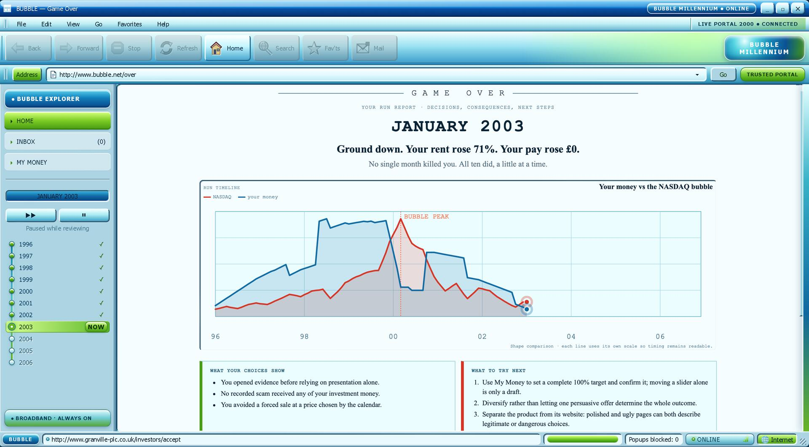

# BUBBLE

**A deterministic financial survival game that helps young people experience inflation, risk and the cost of doing nothing.**

[Play the live demo](https://bubble-sim.pages.dev/) · [Read the demo guide](./DEMO.md)



> Built collaboratively at the **Work in FinTech AI Summit at NatWest**, attended by around 120 participants selected from roughly 1,300 applicants. The selection figures refer to participants, not to BUBBLE as a project.

BUBBLE puts the player in January 1996 with a fixed salary, an empty portfolio and a decade of rising living costs ahead. Time advances month by month while messages introduce fictional financial products, market events and unexpected expenses. The goal is not to get rich: it is to make informed decisions and stay solvent through December 2006.

The project responds to a London Foundation for Banking & Finance brief. It is an educational simulation, not financial advice, and never uses real money.

## The problem

Young people encounter inflation, investing, fees, scams and financial shocks before they have many safe opportunities to practise responding to them. BUBBLE turns those ideas into a short, consequence-driven game: a salary that never rises is steadily squeezed by living costs, and every offer must be assessed using the evidence available in the game.

The simulation is designed around one central lesson: leaving money untouched is still a financial decision. **In the calibrated simulation, a player who keeps all their money in cash becomes insolvent by March 2000.**

## How it works

- The simulation covers 132 months, from January 1996 to December 2006.
- Each month applies pay, expenses, market movements, fees, scheduled events and a solvency check in a fixed order.
- Opportunities and traps arrive through an inbox and period-style pop-up windows rather than a curated product list.
- Accepting a fictional product only unlocks it; the player separately chooses whether and how much to allocate.
- Blocking life events pause the clock and may require cash or the sale of investments.
- The interface evolves at 1998 and 2000 milestones while preserving the same underlying controls.
- A final report scores survival and reflects the player's decisions, fees, scam exposure, forced sales and missed warning signs.

The run is deliberately authored rather than procedurally generated. Its events, market path and interface behaviour are reproducible, making playthroughs and automated verification deterministic.

## Key features

- A pure, deterministic monthly simulation engine
- A fixed timeline of mail, pop-ups, shocks, windfalls and market events
- Portfolio allocation with cash and multiple fictional investment vehicles
- Product fact sheets with comparable fields and inspectable warning signs
- Forced-sale handling when cash cannot cover an expense
- Period-inspired browser chrome with working navigation and load states
- Visual interface transitions across 1996, 1998 and 2000
- Live nominal and present-day purchasing-power views
- Personal and NASDAQ performance charts
- An outcome report with decision-specific feedback
- Fully static, offline-capable production output with no backend or runtime data fetching

## Tech stack

- React 18, TypeScript and Vite
- Vitest, jsdom and ESLint
- CSS custom properties for the era-based visual system
- Static JSON datasets generated by repository scripts

## Architecture and implementation

The project separates game rules from presentation:

```text
src/sim      Pure simulation functions, state transitions and scoring
src/script   The typed, dated event timeline
src/data     Generated market and living-cost series
src/content  Messages, fact sheets, offer pages and ending copy
src/chrome   Browser shell, navigation, dialogs and pop-ups
src/pages    Home, mail, portfolio, offers and final report
src/ui       React integration around the simulation engine
```

The headless runner and interactive React experience use the same simulation rules. Given the same timeline and decisions, they produce the same outcome. The build also avoids runtime randomness: seemingly variable presentation details are authored or derived deterministically from the current month.

Market paths are reconstructed from documented historical anchor points to preserve the timing and broad magnitude of the period, including the dot-com rise and drawdown. Intervening monthly values are interpolated and should not be treated as an archive of exact closes. Fictional investment vehicles apply authored fees and outcomes on top of these series. Living-cost paths use authored annual component rates documented in the repository. See [`scripts/source-data/indices.ts`](./scripts/source-data/indices.ts), [`scripts/build-series.ts`](./scripts/build-series.ts) and the metadata in [`src/data`](./src/data) for the implementation and provenance notes.

## Run locally

Prerequisites: a current Node.js LTS release and npm.

```bash
git clone https://github.com/aarianmm/bubble-sim.git
cd bubble-sim
npm ci
npm run dev
```

Vite will print the local address to open in a browser. The experience is designed for a desktop-sized viewport; the application displays a fallback below its supported minimum size.

To create and preview a production build:

```bash
npm run build
npm run preview
```

## Testing

Run the complete lint, type-check and test suite:

```bash
npm run check
```

Run the dedicated simulation calibration suite:

```bash
npm run verify
```

Regenerate the checked-in market and living-cost datasets after changing their source definitions:

```bash
npm run build:series
```

Do not edit the generated series JSON by hand. Known calibration limitations and other open work are tracked in [`KNOWN-ISSUES.md`](./KNOWN-ISSUES.md).

## Hackathon context

BUBBLE was developed collaboratively at the Work in FinTech AI Summit at NatWest in response to a London Foundation for Banking & Finance brief. Around 120 participants attended after being selected from roughly 1,300 applicants; those figures describe participant selection, not project selection.

The concept focuses on preventive financial education for 15–18-year-olds through rehearsal: players experience inflation, fees, risk, misleading offers and unexpected costs without connecting accounts or using real funds.

The application uses real index names only as historical market references. All firms, funds and financial products presented to the player are fictional.

## Contributors

BUBBLE is a team project. Repository history records contributions from:

- [Aarian (`@aarianmm`)](https://github.com/aarianmm)
- Charlotte Chung
- [Shikhar Jaiswal (`@shikijai-cyber`)](https://github.com/shikijai-cyber)
- [Akshara Trivedi (`@aksharatrivedi07-commits`)](https://github.com/aksharatrivedi07-commits)

See the repository's [commit history](https://github.com/aarianmm/bubble-sim/commits/main/) for the collaborative development record.

## Disclaimer

BUBBLE is an educational simulation. It does not provide financial advice, recommend real products or handle real money. Historical market paths are reconstructed for gameplay as described above; all companies and funds depicted in the game are invented.
